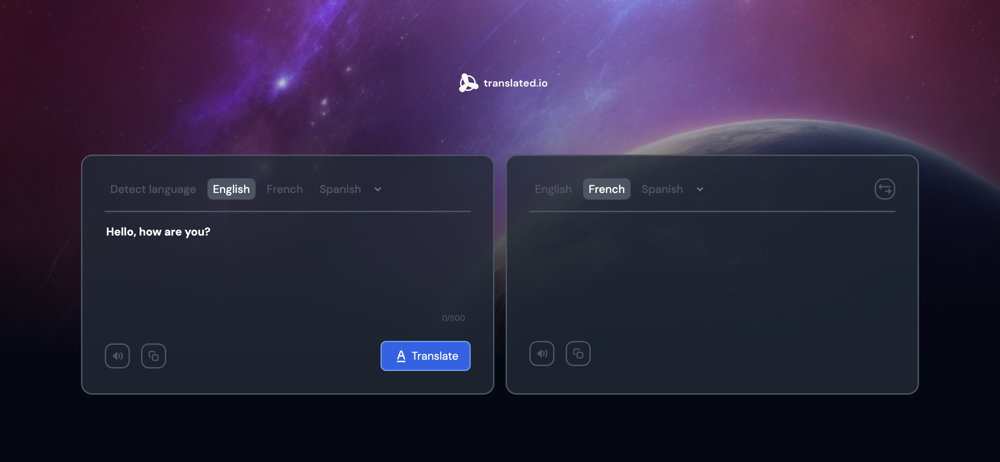

# DevChallenges Translation App

## Description

This is a simple text translation app that allows users to translate text from English to Spanish and vice versa. The app uses the [MyMemory translation API](https://mymemory.translated.net/doc/spec.php) to perform the translations.
## Features

- Users can write the text they want to translate in the input field
- Users can select the language they want to translate the text from
- Users can select the language they want to translate the text to
- Users can click the translate button to translate the text
- Users can see the translated text in the output field
- Users can click the swap button to swap the languages and the text
- Users can copy the original text or the translated text to the clipboard
- Users can click a button to hear the original text or the translated text

## Technologies

- [React](https://reactjs.org/)
- [TypeScript](https://www.typescriptlang.org/)
- [Sass](https://sass-lang.com/)
- [pnpm](https://pnpm.io/)
- [Vite](https://vitejs.dev/)
- [MyMemory translation API](https://mymemory.translated.net/doc/spec.php)
- [React hot toast](https://react-hot-toast.com/)
- [Axios](https://axios-http.com/)
- [Web Speech API](https://developer.mozilla.org/en-US/docs/Web/API/Web_Speech_API)

## Installation

1. Clone the repository
2. Run `pnpm install` to install the dependencies
3. Run `pnpm dev` to start the development server
4. Open `http://localhost:5173` in your browser

## Live Demo

[translated-io](https://robert-translated-io.netlify.app/)

## Screenshot

## Author

- [Robert Ramirez](https://robert-ramirez.co/)
- [LinkedIn](www.linkedin.com/in/roberto-ramirez-aguilar)